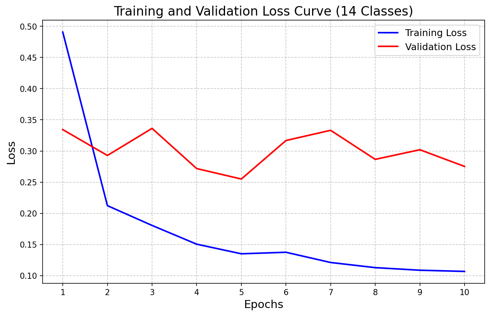

This project is for ESIEE Paris E4 Project Perception/AI part, in the repository you can find all the source code that we used in data collecting, training and ROS node.

Link of the report: https://fr.overleaf.com/3942664759hcynsrnbssfb#85ce1c

# E4 Project — Perception / AI Part

> **ESIEE Paris — E4 Engineering Project**
> This repository contains the full pipeline for the **Perception module** of an autonomous driving project built on the CARLA simulator. It covers data collection, dataset preparation, model training, evaluation, and ROS 2 deployment.

---

## Table of Contents

1. [Project Overview](#project-overview)
2. [Repository Structure](#repository-structure)
3. [System Requirements](#system-requirements)
4. [Installation](#installation)
5. [Pipeline](#pipeline)
   - [Step 1 — Data Collection (CARLA)](#step-1--data-collection-carla)
   - [Step 2 — Dataset Splitting](#step-2--dataset-splitting)
   - [Step 3 — Model Training](#step-3--model-training)
   - [Step 4 — Evaluation (mIoU)](#step-4--evaluation-miou)
   - [Step 5 — Inference Visualization](#step-5--inference-visualization)
   - [Step 6 — ROS 2 Deployment](#step-6--ros-2-deployment)
6. [Class Mapping](#class-mapping)
7. [Model Architecture](#model-architecture)
8. [Results](#results)
9. [ROS 2 Node Interface (for Nav2 Team)](#ros-2-node-interface-for-nav2-team)

---

## Project Overview

This project implements a **real-time semantic segmentation pipeline** for autonomous driving perception. The model is trained entirely on synthetic data generated from the **CARLA simulator** and is designed to be integrated into a ROS 2 stack for downstream tasks such as path planning and obstacle avoidance.

**Key design choices:**
- **13 AD-focused semantic classes** (merged from CARLA's 29 raw labels) tailored for autonomous driving
- **DeepLabV3 + ResNet101** backbone for high-accuracy dense prediction
- **Weighted cross-entropy loss** to handle class imbalance (pedestrians, traffic lights prioritised)
- **Map-based train/val/test split** to prevent data leakage across environments
- **ROS 2 node** for plug-and-play integration with the Nav2 navigation stack

---

## Repository Structure

```
E4_Project_AI_Part/
│
├── collect_data_complete.py   # CARLA data collection (RGB + semantic masks)
├── resplit_data.py            # Map-based dataset splitting (train/val/test)
├── dataset.py                 # PyTorch Dataset class with augmentation
├── model.py                   # DeepLabV3-ResNet101 model definition
├── train.py                   # Full training loop with early stopping
├── evaluate_miou.py           # mIoU evaluation on test set
├── inference.py               # Visual inference on sample images
├── test_resolution.py         # Resolution compatibility test (ROS camera)
│
├── fake_camera.py             # ROS 2 node — simulates a camera for offline testing
├── semantic_node.py           # ROS 2 node — semantic segmentation inference node
│
├── inference_results_13classes.png   # Sample inference output
├── loss_curve.png                    # Training/validation loss curve
├── ros_resolution_test.png           # ROS resolution test output
└── README.md
```

---

## System Requirements

### For Training & Evaluation

| Requirement | Version |
|-------------|---------|
| Python | 3.8+ |
| PyTorch | 2.0+ |
| torchvision | 0.15+ |
| OpenCV | 4.x |
| NumPy | 1.x |
| Matplotlib | 3.x |
| CUDA (recommended) | 11.8+ |
| CARLA Simulator | 0.9.13+ |

### For ROS 2 Deployment

| Requirement | Version |
|-------------|---------|
| ROS 2 | Humble (recommended) |
| cv_bridge | — |
| rclpy | — |

---

## Installation

```bash
# Clone the repository
git clone https://github.com/shulanxianyue/E4_Project_AI_Part.git
cd E4_Project_AI_Part

# Install Python dependencies
pip install torch torchvision opencv-python numpy matplotlib tqdm pillow

# For ROS 2 nodes
sudo apt install ros-humble-cv-bridge
```

---

## Pipeline

### Step 1 — Data Collection (CARLA)

`collect_data_complete.py` connects to a running CARLA server and automatically collects paired **RGB images** and **semantic segmentation masks** across multiple maps, weather conditions, and dynamic actors.

**Prerequisites:** Start the CARLA server before running this script.

```bash
# Collect 1000 images from Town03
python collect_data_complete.py --map Town03 --nb_images 1000

# Collect from another map with more NPCs
python collect_data_complete.py --map Town01 --nb_images 1000 --npc 3 --pedestrians 10
```

**Arguments:**

| Argument | Default | Description |
|----------|---------|-------------|
| `--host` | `127.0.0.1` | CARLA server IP |
| `--port` | `2000` | CARLA server port |
| `--map` | `Town03` | Target CARLA map |
| `--nb_images` | `1000` | Number of images to collect |
| `--npc` | `1` | Number of NPC vehicles |
| `--pedestrians` | `5` | Number of pedestrian walkers |

**Output structure:**
```
datasets/carla_data/
└── Town03/
    ├── rgb/       # 000000.png, 000001.png, ...
    └── mask/      # 000000.png, 000001.png, ...
```

**Data collection features:**
- 5 weather presets (Clear Noon, Cloudy Sunset, Hard Rain, Mid Rain, Clear Sunset)
- Collision detection — automatically discards invalid spawn points
- 1 FPS sampling (1 frame saved every 20 ticks) to ensure scene diversity
- Synchronous mode for perfectly aligned RGB/mask pairs

---

### Step 2 — Dataset Splitting

`resplit_data.py` organises collected data into a **map-based train/val/test split**, ensuring no map appears in more than one split (prevents data leakage).

```bash
python resplit_data.py
```

**Default map assignment:**

| Split | Maps |
|-------|------|
| Train | Town01, Town03, Town06, Town07, Town10HD |
| Val   | Town04 |
| Test  | Town05 |

**Output structure:**
```
datasets/explicit_map_split/
├── train/
│   ├── rgb/
│   └── mask/
├── val/
│   ├── rgb/
│   └── mask/
└── test/
    ├── rgb/
    └── mask/
```

---

### Step 3 — Model Training

`train.py` trains a **DeepLabV3-ResNet101** model on the prepared dataset.

```bash
python train.py
```

**Key hyperparameters** (editable at the top of `train.py`):

| Parameter | Value | Description |
|-----------|-------|-------------|
| `BATCH_SIZE` | 2 | Batch size (increase if VRAM allows) |
| `LEARNING_RATE` | 1e-4 | Initial learning rate |
| `NUM_EPOCHS` | 20 | Maximum training epochs |
| `EARLY_STOPPING_PATIENCE` | 5 | Stop if val loss doesn't improve |

**Training features:**
- ImageNet-pretrained ResNet101 backbone (fine-tuned)
- Weighted cross-entropy loss (safety-critical classes prioritised)
- AdamW optimizer + Cosine Annealing LR scheduler
- Mixed-precision training (AMP) for faster GPU training
- Early stopping based on validation loss
- Automatic loss curve saved to `loss_curve.png`

**Output:**
- `best_carla_model_13classes_weighted.pth` — best model checkpoint
- `loss_curve.png` — training/validation loss plot

---

### Step 4 — Evaluation (mIoU)

`evaluate_miou.py` computes the **mean Intersection over Union (mIoU)** score across all 13 classes on the held-out test set.

```bash
python evaluate_miou.py
```

The script prints a per-class IoU breakdown and the final mIoU score.

---

### Step 5 — Inference Visualization

`inference.py` randomly samples 3 images from the test set and produces a side-by-side comparison of the original image, ground truth mask, and model prediction.

```bash
python inference.py
```

Output saved to `inference_results_13classes.png`.

To test the model at the **ROS camera resolution (1241×376)**:

```bash
python test_resolution.py
```

Output saved to `ros_resolution_test.png`.

---

### Step 6 — ROS 2 Deployment

See the full [ROS 2 Node Interface](#ros-2-node-interface-for-nav2-team) section below.

---

## Class Mapping

The 29 raw CARLA semantic labels are merged into **13 AD-focused classes**:

| Class ID | Class Name | Color | Priority |
|----------|------------|-------|----------|
| 0 | Unlabeled | ⬛ Black `(0,0,0)` | — |
| 1 | Road | 🟣 Purple `(128,64,128)` | Low |
| 2 | Sidewalk | 💗 Pink `(244,35,232)` | Low |
| 3 | RoadLine | 🟢 Bright Green `(157,234,50)` | High |
| 4 | Vehicles/Agents | 🔵 Dark Blue `(0,0,142)` | High |
| 5 | Pedestrian | 🔴 Crimson `(220,20,60)` | **Critical** |
| 6 | TrafficLight | 🟠 Orange `(250,170,30)` | **Critical** |
| 7 | TrafficSign | 🟡 Yellow `(220,220,0)` | High |
| 8 | Pole | ⬜ Light Grey `(153,153,153)` | Medium |
| 9 | Structures | ◼ Dark Grey `(70,70,70)` | Low |
| 10 | Nature/Terrain | 🌿 Forest Green `(107,142,35)` | Low |
| 11 | Sky | 🔷 Sky Blue `(70,130,180)` | Low |
| 12 | Obstacles/Misc | 🩵 Teal `(110,190,160)` | Medium |

---

## Model Architecture

```
DeepLabV3
└── Backbone: ResNet101 (ImageNet pretrained)
└── ASPP (Atrous Spatial Pyramid Pooling)
└── Classifier Head → Conv2d(256, 13, 1×1)
└── Auxiliary Classifier → Conv2d(256, 13, 1×1)

Input:  [B, 3, H, W]   (any resolution — fully convolutional)
Output: [B, 13, H, W]  (per-pixel class logits)
```

The model is **resolution-agnostic** — it has been tested at both 800×600 (training resolution) and 1241×376 (ROS camera resolution) without any architectural changes.

---

## Results

| Metric | Value |
|--------|-------|
| Training epochs | 12 (early stopping) |
| Best validation loss | ~0.23 |
| Final training loss | ~0.10 |




---

## ROS 2 Node Interface (for Nav2 Team)

This section describes how to integrate the perception module into your ROS 2 / Nav2 stack.

### Required Files

Place these files in the same working directory:

```
semantic_node.py
model.py
best_carla_model_13classes_weighted.pth    ← request this from the perception team
```

### Topic Interface

| Direction | Topic | Message Type | Encoding |
|-----------|-------|-------------|----------|
| **Input** (Subscribe) | `/fake_camera/image_raw` | `sensor_msgs/Image` | `bgr8` |
| **Output** (Publish) | `/perception/semantic_mask` | `sensor_msgs/Image` | `rgb8` |

> To use a real camera, change `INPUT_RGB_TOPIC` on line 13 of `semantic_node.py` to your camera's topic name.

### Launching the Nodes

**Terminal 1** — Start the fake camera (for offline testing):
```bash
python3 fake_camera.py
```
This node reads images from `datasets/explicit_map_split/test/rgb/` and publishes them at **10 Hz** on `/fake_camera/image_raw`, simulating a real camera stream.

**Terminal 2** — Start the segmentation node:
```bash
python3 semantic_node.py
```

### Verifying the Output

```bash
# Check that the topic is being published
ros2 topic list
ros2 topic hz /perception/semantic_mask

# Visualize in RViz2
rviz2
# Add → Image → Topic: /perception/semantic_mask
```

### Output Format

The published mask is a **colorized RGB image** of the same resolution as the input. Each pixel color corresponds to a semantic class (see [Class Mapping](#class-mapping) above).

For Nav2 integration, the most relevant classes are:

| Class ID | Class | Use Case |
|----------|-------|----------|
| 1 | Road | Drivable area detection |
| 2 | Sidewalk | Boundary detection |
| 3 | RoadLine | Lane keeping |
| 4 | Vehicles | Dynamic obstacle avoidance |
| 5 | Pedestrian | Safety-critical obstacle avoidance |
| 6 | TrafficLight | Traffic rule compliance |

### Important Notes

- The node **automatically detects GPU**. CUDA is strongly recommended — CPU inference will be significantly slower.
- The output mask `header` (timestamp + frame_id) is **copied from the input message**, ensuring proper time synchronization with Nav2.
- The model has been validated at **1241×376** (ROS camera resolution) — see `ros_resolution_test.py`.
- The model weights file (`.pth`) is **not included** in the repository due to file size. Request it from the perception team.
